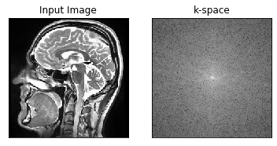
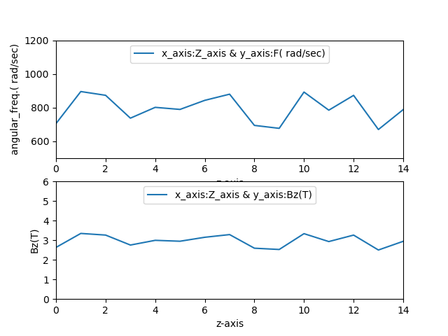
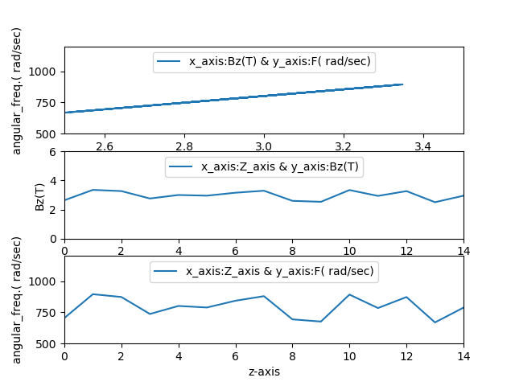

# Bloch Equation Simulation
## submitted to :
### Dr Inas Yassin
---
## submitted by:
### Alzahraa Eid Ad-Elfattah
### Amany Bahaa El-Din
### Esraa Sayed Mustafa
---
---
Our submission for this Assignment #2 is based on The main points which were previously implemented in Assignment #1.
So, it is also based on some main common assumptions which are

1) Using T1 = 600ms , T2= 100ms .


 Now, we can talk about our submission step by step:
 # 1) K-space: 

 *k*-space often refers to the *temporary image space*, usually a matrix, in which data from digitized MR signals are stored during data acquisition. When *k*-space is full (at the end of the scan) the data are mathematically processed to produce a final image. Thus *k*-space holds *raw* data before *reconstruction*.

now the implementation:


 ```
img = cv2.imread('brain.jpeg',0)
f = np.fft.fft2(img)
fshift = np.fft.fftshift(f)
k_space = 20*np.log(np.abs(fshift))

 ```
Then, for the sake of plotting and viewing the result, we have implemented the following code lines:
```
plt.subplot(121),plt.imshow(img, cmap = 'gray')
plt.title('Input Image'), plt.xticks([]), plt.yticks([])
plt.subplot(122),plt.imshow(k_space, cmap = 'gray')
plt.title('k-space'), plt.xticks([]), plt.yticks([])
plt.show() 
```
Now we can say that the previous code managed to get the K-space of the image resulting in:




---
---
# 2) Simulating Non-Uniformity effect
The required at this point is to find the difference in angular frequency between the molecules of hydrogen atoms.
This requirement is based on the previously implemented Non-Uniformity effect function in Assignment#1 submission, which required simulating the non-uniformity effect; where its effect is imposed in the axial (z), and to make a plot of Bz(z).

This function was thought about how it can be implemented by creating random values representing non-uniform effect of variation magnetic field within range of 3T imposed in the axial (z).
The following code creates 15 random values from the specified range and append the list"Non-Uniform" with the new values representing the non-uniformity, and the new generated value is multiplied by (2*3.14*42.58) to get the corresponding angular frequency , where:

42.58 ->(Gamma bar) is the gyromagnetic ratio in MHz/T , so, we needed to multiply it by (2*pi) to get (Gamma)

and according to the Larmor Equation:
   ```
                                ω = γB
   ```
   the angular frequency equals multiplying the gyromagnetic ratio (Gamma) by the magnetic field
```
random.seed(1)
NonUniform_B=[]
X=[]
for i in range(15):
    NonUniform_B.append(random.uniform(2.5 , 3.5))
    
    X.append((42.58*2*3.14)*NonUniform_B[i])
    i+=1
```

and for representing the values in an organized way, we implemented a piece of code to create table carrying the values corresponding to each other :
```
x = PrettyTable()
column_names = ["Angular_freq.( rad/sec)", "Magnetic Field(T)"]
x.add_column(column_names[0] , X)
x.add_column(column_names[1] , NonUniform_B)
print(x)
```
the previous code lines resulted in the following table of Angular frequencies (rad/sec) and magnetic field intensity (T). 


After representing the values, we need to plot them to visualize the difference between frequencies with non-uniform effect of magnetic filed :

```
figure , axs = plt.subplots(2)
axs[0].set_ylim(500, 1200)
axs[0].set_xlim(0,14)
axs[0].plot(X , label='x_axis:Z_axis & y_axis:F( rad/sec)')
axs[0].set_ylabel('angular_freq.( rad/sec)')
axs[0].set_xlabel('z-axis')
axs[0].legend(loc='upper center')

axs[1].set_ylim(0, 6)
axs[1].set_xlim(0,14)
axs[1].plot(NonUniform_B , label='x_axis:Z_axis & y_axis:Bz(T)')
axs[1].set_ylabel('Bz(T)')
axs[1].set_xlabel('z-axis')
axs[1].legend(loc='upper center')

plt.show()
```
resulting in the following plot


which visualizes each resulting value of non-uniform magnetic field and its corresponding frequency.

But we are seeking for representing the relation between the resulted non-uniform magnetic field and angular frequency which is supposed to be linear relation: 
```
axs[0].set_xlim(2.5, 3.5)
axs[0].set_ylim(500,1200)
axs[0].plot(NonUniform_B , X , label='x_axis:Bz(T) & y_axis:F( rad/sec)')
axs[0].set_ylabel('angular_freq.( rad/sec)')
axs[0].set_xlabel('Bz(T)')
axs[0].legend(loc='upper center')

axs[1].set_ylim(0, 6)
axs[1].set_xlim(0,14)
axs[1].plot(NonUniform_B , label='x_axis:Z_axis & y_axis:Bz(T)')
axs[1].set_ylabel('Bz(T)')
axs[1].set_xlabel('z-axis')
axs[1].legend(loc='upper center')

axs[2].set_ylim(500, 1200)
axs[2].set_xlim(0,14)
axs[2].plot(X , label='x_axis:Z_axis & y_axis:F( rad/sec)')
axs[2].set_ylabel('angular_freq.( rad/sec)')
axs[2].set_xlabel('z-axis')
axs[2].legend(loc='upper center')

```


and the slope of this linear relation is the gyromagnetic ratio (Gamma)

---
---


# 3) Bulk Magnetization's Trajectory
The required for this part is to plot the bulk magnetization’s trajectory and generate a figure representing the results.
here we have taken the data for the magnetic field intensity and angular frequencies resulted from the previous part, and applied some processing steps to be able to plot its precession and decay features.

We can explain these steps briefly ....
The bulk magnetization vector is subjected to :
-Transverse relaxation (represented in matrix A in the code lines) which is an exponential decay process of the x & y components of magnetization.
-The longitudinal relaxation (represented in matrix B) in which the magnetization recovers exponentially , these steps were to calculate the magnetization and signal levels as functions of M0.

-After that we need to simulate precession, which is rotation around z-axis

```
def vector_processing(t,t1,t2,f):
   phi = f
   a=[[np.exp(-t/t2), 0, 0],[0 ,np.exp(-t/t2), 0],[ 0, 0, np.exp(-t/t1)]]
   B=[0,0,1-np.exp(-t/t1)]
   A=np.dot(a,zrot(phi))
   return (A,B)

def zrot(theta):
    Rz = [[np.cos(theta),-np.sin(theta), 0],[np.sin(theta),np.cos(theta),0],[0,0,1]]
    return(Rz)

def vector(a,b):
    M=np.empty((n,3))
    
    M[0,:]=np.array([1,0,0])
    for i in range(n-1):
        M[i+1,:]=np.dot(a,M[i,:])+b
    return (M[:,0],M[:,1])

xdata1=[[],[],[]]
ydata1=[[],[],[]]

n=100

#T=np.linspace(0,15,1)
zp=np.arange(100)
for i in range (3):
     a,b = vector_processing(1,600,100,X[i+2])
     
     xdata1[i],ydata1[i]=vector(a,b)
    
plotting1x=[]
plotting1y=[]

plotting2x=[]
plotting2y=[]

plotting3x=[]
plotting3y=[]
    
for i in range (100):
    plotting1x.append(xdata1[0][i])
    plotting1y.append(ydata1[0][i])
    
    plotting2x.append(xdata1[1][i])
    plotting2y.append(ydata1[1][i])
    
    plotting3x.append(xdata1[2][i])
    plotting3y.append(ydata1[2][i])
    
    ax.plot(plotting1x,plotting1y,zp[:i+1],'red')
    ax.plot(plotting2x,plotting2y,zp[:i+1],'green')
    ax.plot(plotting3x,plotting3y,zp[:i+1],'blue')
    pyplot.savefig('temp_file.png') 
    images.append(imageio.imread('temp_file.png'))
imageio.mimsave('bulk_mag_trajectory.gif', images, duration=0.1)
```


### Requirements:
For each point in this simulation there were some requirements to achieve its results, like installing and importing some important libraries which are:
1) numpy : for dealing with data stored in arrays.
2) matplotlib : for plotting all graphs and components.
3) cv2 : for reading image to calculate its Fourier Transform.
4) random : for creating random values to describe .non-uniformity effect
5) prettytable : for creating table of values.
6) imageio : for handling GIF file
7) mpl_toolkits.mplot3d : for plotting in 3d plane.